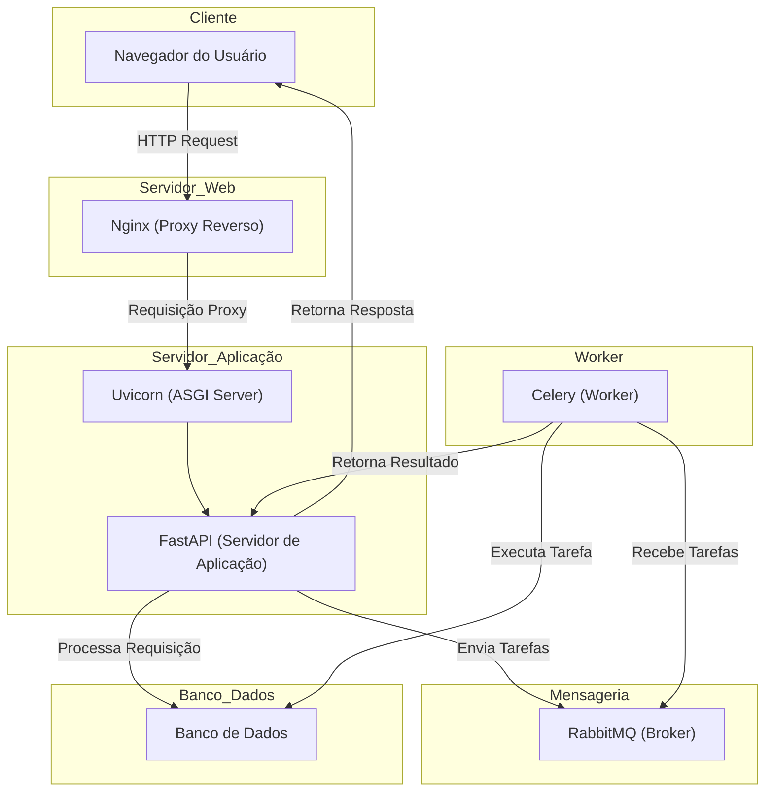

# Estrutura Servidor 🖥️

Estudo para estruturar uma maquina com **windows 11** para servir aplicações em LAN atravez de proxy reverso utilizando um servidor web e banco de dados local e tecnicas de programação distuibuida com mensageria.

## Ferramentas 🛠️
### Download e instalação manuais 🧩
- Servidor web: [Nginx/Windows (**1.27.4**)](https://nginx.org/download/nginx-1.27.4.zip)
- Broker: [RabbitMQ (**4.0.7**)](https://github.com/rabbitmq/rabbitmq-server/releases/download/v4.0.7/rabbitmq-server-4.0.7.exe)
  - Dependencia do RabbitMQ: [Erlang/OTP (**27.3**)](https://github.com/erlang/otp/releases/download/OTP-27.3/otp_win64_27.3.exe)
  
### Bibliotecas Python 🐍
- Framework web: [FastAPI (**"^0.115.8"**)](https://fastapi.tiangolo.com/#installation)
  - Servidor de aplicação: [Uvicorn (**^0.12.0**)](https://www.uvicorn.org/settings/)
- Worker: [Celery (**^5.4.0**)](https://docs.celeryq.dev/en/stable/) + [Eventlet (**^0.39.1**)](https://eventlet.readthedocs.io/en/latest/#installation) + [Flower (**^2.0.1**)](https://flower.readthedocs.io/en/latest/install.html#installation)

## Diagrama de relações 🔀 


## Exemplo de execução ▶️
Após realizar o download e a instação das ferramentas manuais no **windows 11**, criar o projeto python e ambiente virtual e instalar as dependencias das bibliotecas python.

> ⚠️ **Atenção:** Nesta estrutura estou utilizando o python na **versão 3.13.1**

1. Encerrar todos os serviços abertos do RabbitMQ e inicializar serviço de **Broker** atravez do arquivo **_rabbitmq-server.bat_** que fica no caminho: ```C:\Program Files\RabbitMQ Server\rabbitmq_server-4.0.7\sbin```


2. Iniciar a aplicação FastAPI que importa as funções/tarefas já com o decorador do celery atravez do comando:
    ```python
    # caminho_projeto\app.py
    from fastapi import FastAPI
    from caminho_projeto.tasks import ola_mundo

    app = FastAPI()

    @app.get('/')
    def read_root():
        ola_mundo.delay()
        return {'message': 'Requisição recebida.'}
    ```
    ```shell
    fastapi dev <caminho_projeto>\app --port 8000
    ```
3. Iniciar o celery que já possui as funções com o decorador de task:
   ```python
   # caminho_projeto\tasks.py
   from celery import Celery

    app_celery = Celery(
        broker='pyamqp://guest@localhost//'
    )

    @app_celery.task
    def ola_mundo():
        return 'olá mundo'
   ```
   ```shell
   celery -A <caminho_projeto>.tasks worker -l INFO -P eventlet
   ```
4. Iniciar o daskborad do celery, o **flower**, para exibição das tarefas de maneira mais estruturada:
   ```shell
   celery -A <caminho_projeto>.tasks flower -l INFO --persistent=True
   ```